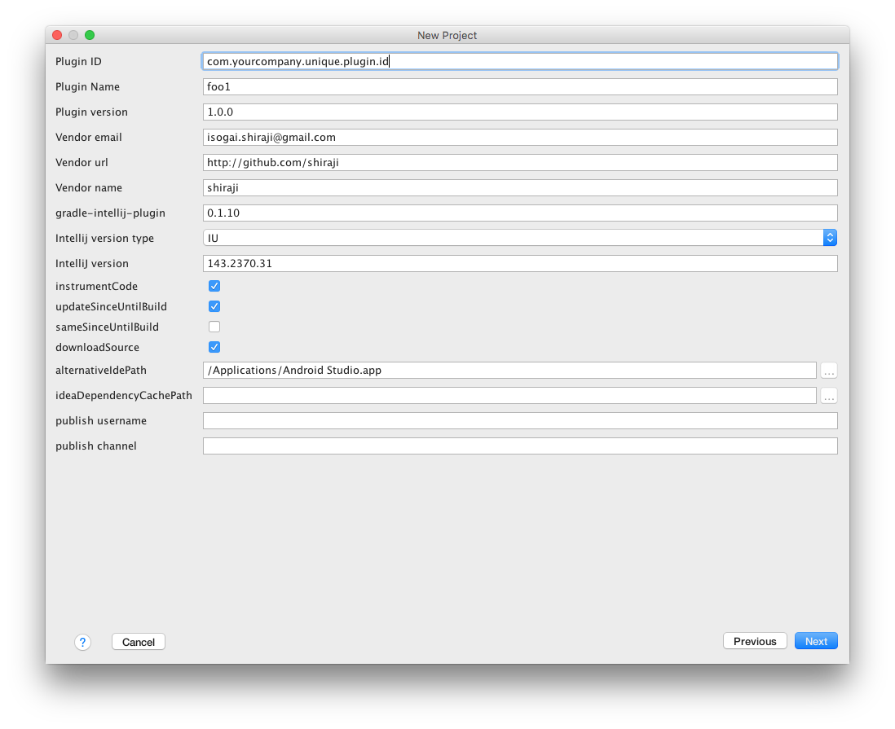

# gradle-intellij-plugin wizard

IntelliJ plugin that adds a wizard that creates a plugin module with [gradle-intellij-plugin](https://github.com/JetBrains/gradle-intellij-plugin).




# Limitations

* Only Java/Kotlin support. (Help me find a way to create a plugin using Groovy, Scala or any other languages)
* Missing some options of [gradle-intellij-plugin](https://github.com/JetBrains/gradle-intellij-plugin)
* Help(?) button does not work

# How to install?

Use the IDE's plugin manager to install the latest version of the plugin.

```
Copyright 2016 Yoshinori Isogai

Licensed under the Apache License, Version 2.0 (the "License");
you may not use this file except in compliance with the License.
You may obtain a copy of the License at

   http://www.apache.org/licenses/LICENSE-2.0

Unless required by applicable law or agreed to in writing, software
distributed under the License is distributed on an "AS IS" BASIS,
WITHOUT WARRANTIES OR CONDITIONS OF ANY KIND, either express or implied.
See the License for the specific language governing permissions and
limitations under the License.
```
